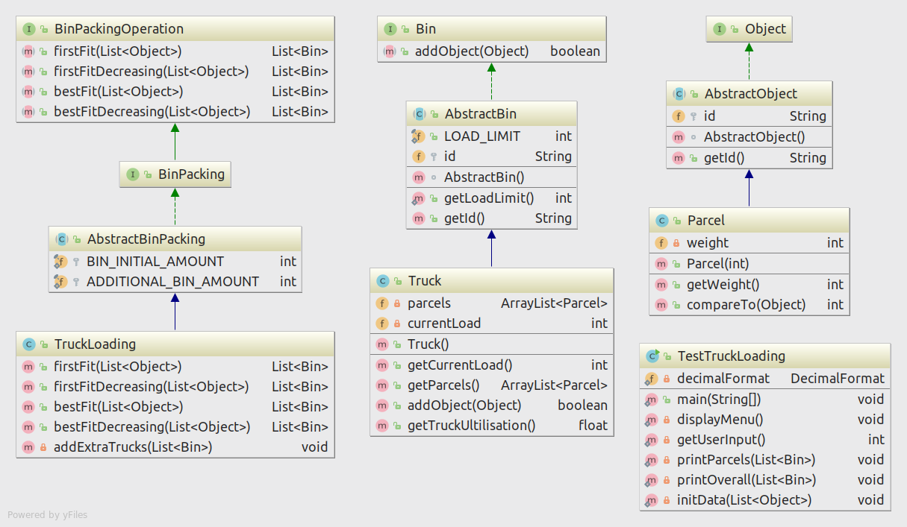
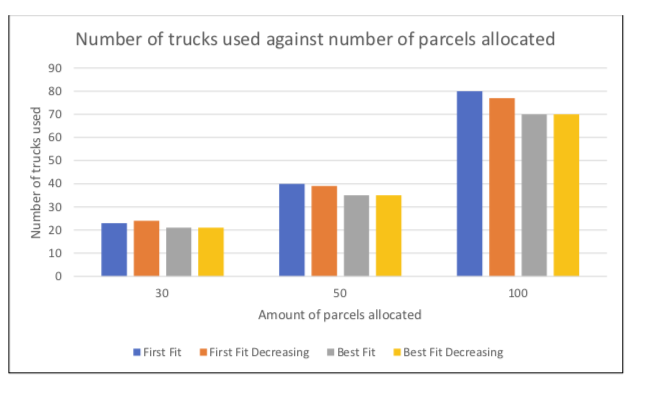

# bin-packing
Bin Packing Problem (Minimise number of used Bins)


## Problem
Pack parcels into trucks, using fewest trucks. Assume all trucks have the same load limit

### Solution
#### UML diagram


#### Big-O Notation

| Algorithms  | Big-O Notation |
| ------------- | ------------- |
| First Fit  | ```O(n)``` |
| First Fit Decreasing | Best case: ```O(n)```, Worst case: ```O(n log n)```|
| Best Fit | O(<text>n</text><sup>2</sup>) |
| Best Fit Decreasing | Best and worst case: O(<text>n</text><sup>2</sup>) |

#### Truck Utilisation


#### Sample Output
